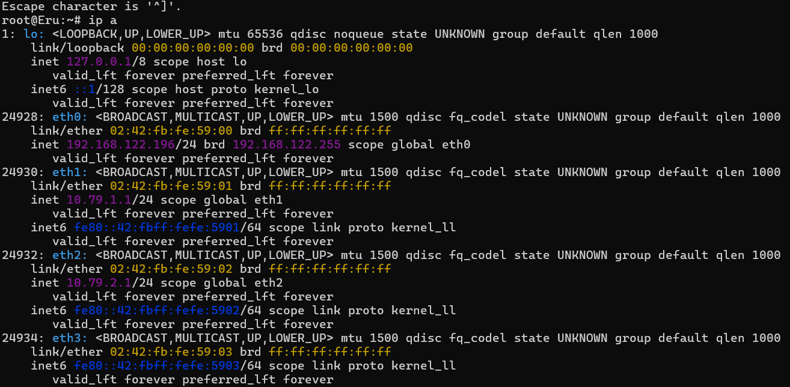

# Jarkom-Modul-1-2025-K-31

## Angggota

| Anggota | NRP  |
| ------- | --- |
| Shinta Alya Ramadani | 5027241016 |
| Rayhan Agnan Kusuma | 5027241102 |

## Prefix IP yang digunakan untuk kelompok K-31

| Nama Kelompok   | Prefix IP |
| ----------- | --------- | 
| K-31         |      10.79   | 


## Soal Nomor 1
Untuk mempersiapkan pembuatan entitas selain mereka, Eru yang berperan sebagai Router membuat dua Switch/Gateway. Dimana Switch 1 akan menuju ke dua Ainur yaitu Melkor dan Manwe. Sedangkan Switch 2 akan menuju ke dua Ainur lainnya yaitu Varda dan Ulmo. Keempat Ainur tersebut diberi perintah oleh Eru untuk menjadi Client.

## Keterangan Fungsi Setiap Komponen
Eru (Router)
Fungsi Utama: Eru bertindak sebagai Router. Posisinya berada di tengah, menghubungkan dua jaringan lokal yang berbeda (jaringan Switch1 dan jaringan Switch2) dengan jaringan luar (NAT1).

Tugas:

Menghubungkan Jaringan: Menjadi jembatan komunikasi antara jaringan di bawah Switch1 dan jaringan di bawah Switch2.

Gateway Utama: Berperan sebagai gateway atau gerbang utama bagi semua client (Melkor, Manwe, Varda, Ulmo) untuk bisa terhubung ke jaringan luar atau internet (melalui NAT1).

Meneruskan Paket Data: Menerima data dari client dan meneruskannya ke tujuan yang benar, baik itu ke client lain di jaringan yang berbeda maupun ke internet.

Switch1 & Switch2 (Switch)
Fungsi Utama: Keduanya berfungsi sebagai Switch.

Tugas:

Menghubungkan Client: Menjadi titik koneksi pusat untuk perangkat-perangkat (client) yang ada dalam satu segmen jaringan lokal yang sama.

Contoh: Switch1 menghubungkan Melkor dan Manwe, sementara Switch2 menghubungkan Varda dan Ulmo.

Mengelola Lalu Lintas Lokal: Mengirimkan paket data secara efisien hanya ke perangkat tujuan di dalam jaringannya, bukan menyebarkannya ke semua perangkat.

Melkor, Manwe, Varda, & Ulmo (Client)
Fungsi Utama: Keempatnya adalah Client atau end device (perangkat akhir).

Tugas: Mereka adalah komputer atau perangkat pengguna akhir dalam jaringan yang meminta dan menerima informasi atau layanan. Untuk bisa berkomunikasi dengan dunia luar atau dengan client di jaringan switch yang berbeda, mereka harus melalui gateway mereka, yaitu Eru.

NAT1 (Koneksi Internet/Jaringan Luar)
Fungsi Utama: NAT (Network Address Translation) ini merepresentasikan koneksi ke jaringan luar, seperti internet.

Tugas: Mengizinkan semua perangkat di dalam jaringan lokal (yang biasanya menggunakan alamat IP privat) untuk berbagi satu alamat IP publik saat mengakses internet.

Singkatnya, Eru adalah otaknya yang mengatur lalu lintas antar jaringan, Switch adalah penghubung perangkat dalam satu area, dan para Ainur adalah pengguna akhir dari jaringan tersebut.

### Eru Config
```sh
auto eth0
iface eth0 inet dhcp

auto eth1
iface eth1 inet static
	address 10.79.1.1
	netmask 255.255.255.0

auto eth2
iface eth2 inet static
	address 10.79.2.1
	netmask 255.255.255.0
```

### Melkor Config
```sh
auto eth0
iface eth0 inet static
	address 10.79.1.2
	netmask 255.255.255.0
	gateway 10.79.1.1
```

### Manwe Config
```sh
auto eth0
iface eth0 inet static
	address 10.79.1.3
	netmask 255.255.255.0
	gateway 10.79.1.1
```

### Varda Config
```sh
auto eth0
iface eth0 inet static
	address 10.79.2.2
	netmask 255.255.255.0
	gateway 10.79.2.1
```

### Varda Config
```sh
auto eth0
iface eth0 inet static
	address 10.79.2.2
	netmask 255.255.255.0
	gateway 10.79.2.1
```

## Soal Nomor 2
Karena menurut Eru pada saat itu Arda (Bumi) masih terisolasi dengan dunia luar, maka buat agar Eru dapat tersambung ke internet.


### Config Eru (DNS Master)


1. Memberikan Akses Internet pada Router (Eru)

- Perintah ```sh iptables -t nat -A POSTROUTING -o eth0 -j MASQUERADE -s 10.79.0.0/16``` adalah kunci utamanya. 

Disini kami menggunakan ip config yang sudah dijadikan ketentuan.
Fungsi dari config ini adalah untuk melakukan NAT (Network Address Translation). Secara sederhana, Eru akan "menyamarkan" semua permintaan internet dari para client (Melkor, Varda, dll.) 
seolah-olah permintaan itu berasal dari Eru sendiri. Ketika balasan dari internet datang, Eru akan tahu harus meneruskannya ke client yang mana. 
Inilah yang membuat seluruh jaringan internal bisa mengakses internet hanya melalui satu gerbang (Eru).


## Soal Nomor 3
Karena menurut Eru pada saat itu Arda (Bumi) masih terisolasi dengan dunia luar, maka buat agar Eru dapat tersambung ke internet.

1. Validasi menggunakan ip a untuk mengecek apakah eru itu sudah tersambung ke internet dan juga routingnya.


Eru sebagai Router: Terlihat jelas Eru memiliki banyak antarmuka jaringan (network interface), yaitu eth0, eth1, dan eth2, yang masing-masing terhubung ke jaringan yang berbeda.

eth0 (IP 192.168.122.196/24): Ini adalah antarmuka yang terhubung ke jaringan luar (Internet).

eth1 (IP 10.79.1.1/24): Ini adalah gateway untuk jaringan pertama (tempat Melkor & Manwe berada).

eth2 (IP 10.79.2.1/24): Ini adalah gateway untuk jaringan kedua (tempat Varda & Ulmo berada).


## Soal Nomor 4


## Soal Nomor 5


## Soal Nomor 6

### Soal
Setelah semua Ainur terhubung ke internet, Melkor mencoba menyusup ke dalam
komunikasi antara Manwe dan Eru. Jalankan file berikut (traffic.zip) lalu lakukan packet
sniffing menggunakan Wireshark pada koneksi antara Manwe dan Eru, lalu terapkan
display filter untuk menampilkan semua paket yang berasal dari atau menuju ke IP
Address Manwe. Simpan hasil capture tersebut sebagai bukti.
### Tujuan
Mencatat dan menyimpan bukti lalu-lintas jaringan (packet capture) antara host Manwe dan Eru setelah script traffic.sh dijalankan oleh Melkor. Filter Wireshark yang dipakai: ip.addr == 10.79.1.3 (menampilkan semua paket berasal/tujuan IP Manwe).
### Isi file traffic.sh
```
#!/bin/bash

echo "Memulai pembuatan traffic jaringan selama 10 detik..."

cleanup() {
    echo ""
    echo "Menghentikan semua proses pembuat traffic..."
    kill $(jobs -p) > /dev/null 2>&1
    echo "Selesai."
}

trap cleanup EXIT

ping -i 0.1 8.8.8.8 > /dev/null 2>&1 &

wget -qO /dev/null http://speedtest.tele2.net/10MB.zip &
wget -qO /dev/null http://proof.ovh.net/files/10Mb.dat &

nmap -T4 -F scanme.nmap.org > /dev/null 2>&1 &

sleep 10
```

### Step by step
1. Masuk ke console Melkor (SSH atau terminal lokal).
2. Buat file dan buka editor:
```
nano traffic.sh
```
3. Paste isi traffic.sh, simpan (Ctrl+O, Enter) dan keluar (Ctrl+X).
4. Ubah permission agar executable:
```
chmod +x traffic.sh
```
5. Menjalankan capture di antara Manwe ↔ Eru
6. Pada console Melkor, jalankan:
```
./traffic.sh
```
7. Terapkan display filter di Wireshark (ip.addr == 10.79.1.3) dan simpan hasil terfilter

## Soal Nomor 7
#### Soal
Untuk meningkatkan keamanan, Eru memutuskan untuk membuat sebuah FTP Server
di node miliknya. Lakukan konfigurasi FTP Server pada node Eru. Buat dua user baru:
ainur dengan hak akses write&read dan melkor tanpa hak akses sama sekali ke
direktori shared. Buktikan hasil tersebut dengan membuat file teks sederhana kemudian
akses file tersebut menggunakan kedua user.
#### Tujuan
Menguji implementasi kontrol akses user di FTP Server, memastikan bahwa hanya user tertentu yang dapat mengakses direktori tertentu sesuai dengan hak akses yang ditentukan.
#### Step by step
1. Di console Eru:
```
apt update && apt install -y vsftpd
apt update && apt install -y inetutils-ftp
```
2. Tambah user ainur dan melkor:
```
adduser ainur
passwd ainur
adduser melkor
passwd melkor
```
3. Buat direktori shared untuk ainur dan set ownership + permission:
```
mkdir -p /home/ainur/shared
chown ainur:ainur /home/ainur/shared
chmod 755 /home/ainur /home/ainur/shared
```
 - Edit konfigurasi vsftpd:
```
nano /etc/vsftpd.conf
— Tambahkan / pastikan ada baris berikut di dalam /etc/vsftpd.conf:

local_enable=YES
write_enable=YES
chroot_local_user=YES
allow_writeable_chroot=YES
user_sub_token=$USER
user_config_dir=/etc/vsftpd_user_conf
````
4. Restart service vsftpd:
```
service vsftpd restart
```
5. Buat file tes oleh ainur di server:
```
echo "halo dari ainur" > /home/ainur/shared/test.txt
```
6. (Dari node Eru / local FTP client) — Login FTP sebagai ainur:
```
ftp 10.79.1.1
# Name: ainur
# password: [password]
cd shared
ls
get test.txt
Pwd

echo "Halo FTP dari Ainur" > halo.txt
put halo.txt
bye
```
7. (Dari node Eru / local FTP client) — Login FTP sebagai melkor dan coba akses shared:
```
ftp 10.79.1.1
# Name: melkor
# password: [password]
cd shared
# akses ditolak
bye
```

## Soal Nomor 8
#### Soal
Ulmo, sebagai penjaga perairan, perlu mengirimkan data ramalan cuaca ke node Eru.
Lakukan koneksi sebagai client dari node Ulmo ke FTP Server Eru menggunakan user
ainur. Upload sebuah file berikut (link file). Analisis proses ini menggunakan Wireshark
dan identifikasi perintah FTP yang digunakan untuk proses upload.
#### Tujuan
1. Melatih penggunaan FTP (File Transfer Protocol) untuk mengirim file dari client (Ulmo) ke server (Eru).
2. Membuktikan bagaimana proses upload file melalui FTP berlangsung secara teknis.
3. Menangkap komunikasi FTP dengan Wireshark untuk mengidentifikasi perintah-perintah FTP yang digunakan saat upload, misalnya:
```USER (untuk kirim username)
PASS (untuk kirim password)
STOR (untuk upload file ke server)
TYPE I (set binary mode saat transfer file)
PORT / PASV (negosiasi mode transfer data)
```
4. Menunjukkan kelemahan FTP klasik yaitu data (username, password, perintah, bahkan isi file) dikirim tanpa enkripsi (plaintext), sehingga bisa dengan mudah dilihat di Wireshark.
#### Step by step
1. Di console node Ulmo, download file cuaca.zip:
```
wget --no-check-certificate 'https://drive.google.com/uc?export=download&id=11ra_yTV_adsPIXeIPMSt0vrxCBZu0r33' -O cuaca.zip
ls -l cuaca.zip
```
2. Install FTP client di Ulmo:
```
apt update && apt install -y inetutils-ftp
```
3. Mulai proses capture di Wireshark pada line Ulmo sebelum login ke FTP.
4. Login ke FTP Server Eru menggunakan user ainur:
```
ftp 10.79.2.3
# Masukkan username: ainur
# Masukkan password: [password ainur]
```
5. Cek isi directory setelah login:
```
ls
cd shared
lcd .
```
6. Upload file cuaca.zip ke FTP Server:
```
put cuaca.zip
bye
```
7. Analisis dengan Wiresharkg unakan display filter:
```ftp```
8. Identifikasi perintah FTP yang muncul pada proses upload, yaitu:
```
USER → untuk login dengan username.
PASS → untuk otentikasi password.
CWD → berpindah ke direktori (cd shared).
TYPE I → set mode transfer binary (karena file zip).
STOR cuaca.zip → perintah utama untuk meng-upload file ke server.
QUIT → keluar dari sesi FTP.
```
9. Verifikasi hasil upload di node Eru:
```
ls -l /home/ainur/shared
— Harus ada file cuaca.zip dengan owner user ainur.
```

## Soal Nomor 9
#### Soal
Eru ingin membagikan "Kitab Penciptaan" di (link file) kepada Manwe. Dari FTP Server
Eru, download file tersebut ke node Manwe. Karena Eru merasa Kitab tersebut sangat
penting maka ia mengubah akses user ainur menjadi read-only. Gunakan Wireshark
untuk memonitor koneksi, identifikasi perintah FTP yang digunakan, dan uji akses user
ainur.
#### Tujuan
1. Membuktikan bahwa file Kitab Penciptaan dapat dibagikan dari FTP Server Eru dan diunduh oleh Manwe menggunakan akun ainur.
2. Memonitor koneksi FTP menggunakan Wireshark dan mengidentifikasi perintah FTP yang digunakan, khususnya USER, PASS, CWD, RETR (download), dan STOR (upload).
3. Mengubah hak akses direktori shared milik ainur menjadi read-only untuk memastikan user ainur hanya bisa membaca/download file tetapi tidak bisa meng-upload file ke server.
#### Step by step
1. Di node Eru — download Kitab Penciptaan ke server:
```
wget --no-check-certificate 'https://drive.google.com/uc?export=download&id=11ua2KgBu3MnHEIjhBnzqqv2RMEiJsILY' -O /root/Kitab_Penciptaan.zip
```
2. Pindahkan file ke folder shared milik ainur dan atur kepemilikan + permission awal:
```
cp /root/Kitab_Penciptaan.zip /home/ainur/shared/
chown ainur:ainur /home/ainur/shared/Kitab_Penciptaan.zip
chmod 644 /home/ainur/shared/Kitab_Penciptaan.zip
```
3. Di node Manwe — install FTP client:
```
apt update && apt install -y inetutils-ftp
```
4. Mulai Wireshark di Manwe untuk capture trafik FTP dengan display filter ftp
5. Login ke FTP Server Eru sebagai user ainur dan download file:
```
ftp 10.79.1.1
cd shared
get Kitab_Penciptaan.zip
bye
```
Notes :
```
Perintah FTP yang muncul:
USER → kirim username.
PASS → kirim password.
CWD → pindah ke direktori shared.
RETR Kitab_Penciptaan.zip → download file dari server.
```
6. Verifikasi di node Eru bahwa file ada di folder shared:
```
ls -l /home/ainur/shared/Kitab_Penciptaan.zip
```
6. Ubah permission folder dan file agar read-only (tidak bisa upload/menulis):
```
chmod 555 /home/ainur/shared
chmod 444 /home/ainur/shared/Kitab_Penciptaan.zip
```
7. Di node Manwe — uji kembali login FTP dengan user ainur:
```
ftp 10.79.1.1
cd shared
get Kitab_Penciptaan.zip   # harus berhasil (read-only masih bisa download)
put Kitab_Penciptaan.zip   # harus gagal (karena tidak ada write permission)
```

## Soal Nomor 10
#### Soal
Melkor yang marah karena tidak diberi akses, mencoba melakukan serangan dengan
mengirimkan banyak sekali request ke server Eru. Gunakan command ping dari node
Melkor ke node Eru dengan jumlah paket yang tidak biasa (spam ping misalnya 100
paket). Amati hasilnya, apakah ada packet loss? Catat average round trip time untuk
melihat apakah serangan tersebut mempengaruhi kinerja Eru.
#### Tujuan
1. Menguji efek serangan sederhana berupa ICMP flood (ping spam) dari node Melkor ke node Eru.
2. Menganalisis hasil ping untuk melihat apakah terjadi packet loss dan berapa average RTT (Round Trip Time) sebelum dan saat serangan.
3. Membuktikan apakah serangan tersebut mempengaruhi kinerja jaringan/server Eru.
4. Menggunakan Wireshark untuk memonitor paket ICMP yang dikirim.
#### Step by step
1. Di node Melkor, cek alamat IP terlebih dahulu:
```
ip -4 addr show
```
2. Di Wireshark, set display filter untuk memonitor paket ICMP:
```
icmp
```
3. Lakukan baseline ping (10 paket) ke Eru dan simpan hasilnya:
```
ERU_IP=10.79.1.1
ping -c 10 $ERU_IP | tee baseline_ping.txt
tail -n2 baseline_ping.txt
```
4. Catat hasil baseline:
- Persentase packet loss (baris ringkasan).
- Nilai average RTT (ambil nilai kedua dari rtt min/avg/max/mdev).
```
awk -F'/' '/rtt/ {print "avg RTT=" $5 " ms"}' baseline_ping.txt
grep -oP '\d+(?=% packet loss)' baseline_ping.txt | head -n1 | xargs -I{} echo "packet loss={} %"
```
5. Lakukan serangan spam ping (100 paket) ke server Eru:
```
ping -c 100 $ERU_IP | tee ping_100.txt
tail -n2 ping_100.txt
```
6. Analisis hasil ping spam:
- Packet loss:
```grep 'packet loss' ping_100.txt```
- Average RTT:
```awk -F'/' '/rtt/ {print "avg RTT=" $5 " ms"}' ping_100.txt```
7. Periksa di Wireshark apakah terlihat banjir paket ICMP dari node Melkor ke Eru.

## Soal Nomor 11
#### Soal
Sebelum era koneksi aman, Eru sering menyelinap masuk ke wilayah Melkor. Eru perlu
masuk ke node tersebut untuk memeriksa konfigurasi, namun ia tahu Melkor mungkin
sedang memantau jaringan. Buktikan kelemahan protokol Telnet dengan membuat akun
dan password baru di node Melkor kemudian menangkap sesi login Eru ke node
Melkor menggunakan Wireshark. Tunjukkan bagaimana username dan password dapat
terlihat sebagai plain text.
#### Tujuan
1. Membuktikan kelemahan protokol Telnet — Telnet mentransmisikan data tanpa enkripsi, sehingga semua informasi termasuk username dan password bisa disadap di jaringan.
2. Menunjukkan risiko keamanan login menggunakan Telnet — ketika Eru login ke node Melkor, kredensial (user buktiuser dan password) dapat terlihat sebagai plain text di Wireshark.
3. Memberikan pemahaman mengapa Telnet tidak lagi digunakan di era modern — kelemahan ini alasan protokol Telnet sudah ditinggalkan dan digantikan oleh protokol aman seperti SSH.
4. Mendemonstrasikan teknik sniffing sederhana — yaitu menangkap lalu lintas Telnet dengan Wireshark dan menggunakan fitur Follow TCP Stream untuk melihat isi data.
#### Step by step
1. Di node Melkor: buat user baru
```adduser buktiuser```
2. Di node Melkor: install telnet daemon
```apt install -y inetutils-telnetd```
3. Di node Eru: install telnet client
```apt update && apt install -y telnet```
4. Di node Melkor: edit konfigurasi inetd untuk mengaktifkan telnet
```
nano /etc/inetd.conf

— Hapus komentar (#off#) pada baris:
#<off># telnet  stream  tcp     nowait  root    /usr/sbin/tcpd  /usr/sbin/telnetd
sehingga baris telnet aktif.
```
5. Restart service inetd di Melkor
```
service inetutils-inetd restart
```
6. Verifikasi telnet listening di Melkor (port 23)
```
ss -tlnp | grep :23 || true
```
7. Start capture di Wireshark (capture interface yang melihat traffic antara Eru ↔ Melkor).
— Set display filter Wireshark menjadi : tcp.port == 23
8. Dari node Eru: buka koneksi Telnet ke Melkor
```
telnet 10.79.1.2 23
— Login menggunakan user buktiuser (masukkan password yang dibuat pada langkah 1).
```
9. Di Wireshark: identifikasi paket Telnet
— Pastikan filter telnet atau tcp.port == 23 aktif.
— Klik kanan pada salah satu paket TELNET → pilih Follow → TCP Stream.
Bukti kelemahan Telnet
— Pada jendela Follow TCP Stream akan terlihat username dan password yang diketik di sesi Telnet dalam bentuk plain text, membuktikan Telnet tidak terenkripsi.
  
## Soal Nomor 12
#### Soal
 Eru mencurigai Melkor menjalankan beberapa layanan terlarang di node-nya. Lakukan
pemindaian port sederhana dari node Eru ke node Melkor menggunakan Netcat (nc)
untuk memeriksa port 21, 80, dalam keadaan terbuka dan port rahasia 666 dalam
keadaan tertutup.
#### Tujuan
1. Melakukan pemindaian port sederhana dari node Eru ke node Melkor menggunakan Netcat.
2. Memeriksa bahwa port 21 dan 80 berstatus terbuka, dan port rahasia 666 berstatus tertutup.
#### Step by step
1. Di Eru — install netcat
```
apt update && apt install -y netcat-openbsd
```
2. Set variabel IP Melkor dan lakukan pemindaian port
```
MELKOR=10.79.1.2
nc -zv $MELKOR 21
nc -zv $MELKOR 80
nc -zv $MELKOR 666
```
###### Hasil pemindaian sebelum

3. Di Melkor — pastikan service FTP berjalan pada port 21
```
apt update && apt install -y vsftpd
service vsftpd start
# cek
ss -tlnp | grep :21
```
4. Di Melkor — pastikan service HTTP berjalan pada port 80
```
apt install -y apache2
service apache2 start
# cek
ss -tlnp | grep :80
```
5. Set variabel IP Melkor dan lakukan pemindaian port ulang
```
MELKOR=10.79.1.2
nc -zv $MELKOR 21
nc -zv $MELKOR 80
nc -zv $MELKOR 666
```
###### Hasil pemindaian sesudah


## Soal Nomor 13
#### Soal
Setelah insiden penyadapan Telnet, Eru memerintahkan semua koneksi administratif
harus menggunakan SSH (Secure Shell) untuk mengamankan jaringan. Lakukan
koneksi SSH dari node Varda ke Eru. Tangkap sesi tersebut menggunakan Wireshark.
Analisis dan jelaskan mengapa username dan password tidak dapat dilihat seperti pada
sesi Telnet. Tunjukkan paket-paket terenkripsi dalam hasil capture sebagai bukti
keamanan SSH.
#### Tujuan
1. Mengamankan koneksi administratif dengan mengganti Telnet ke SSH (Secure Shell).
2. Menunjukkan bahwa koneksi SSH terenkripsi sehingga username/password tidak terlihat sebagai plain text pada capture Wireshark.
3. Menangkap sesi SSH dari node Varda ke Eru menggunakan Wireshark dan menunjukkan paket-paket terenkripsi sebagai bukti keamanan.
#### Step by step
1. Di node Eru — update dan install OpenSSH server
```apt update && apt install -y openssh-server```
2. Enable SSH service saat boot
```update-rc.d ssh enable```
3. Start SSH service
```service ssh start```
4. Cek status SSH
```service ssh status```
5. Pastikan port 22 listening
```ss -tlnp | grep :22```
6. Cek proses sshd
```ps aux | grep [s]shd```
7. Set/ubah password root
```passwd root```
8. Cek konfigurasi penting SSH
```grep -E "PermitRootLogin|PasswordAuthentication|UsePAM" /etc/ssh/sshd_config```
9. Edit konfigurasi SSH untuk mengizinkan root/password auth
```nano /etc/ssh/sshd_config
— Pastikan (jika diperlukan) baris berikut ada/di-set:

PermitRootLogin yes
PasswordAuthentication yes
UsePAM yes
```
10. Restart sshd agar konfigurasi baru berlaku
```pkill sshd
/usr/sbin/sshd &
ps aux | grep [s]shd```
11. Di node Varda — test konektivitas ke Eru
```
ping -c 3 10.79.1.1
(Jika muncul warning host key changed) Hapus host lama
ssh-keygen -f "/root/.ssh/known_hosts" -R "10.79.1.1"
```
12. Mulai capture Wireshark pada interface yang melihat trafik Varda↔Eru.
13. Gunakan display filter untuk memudahkan analisis:
```tcp.port == 22```
14. Dari Varda — login SSH ke Eru
```ssh root@10.79.1.1```
15. Jika muncul fingerprint baru, ketik yes.
16. Masukkan password root Eru saat diminta.
17. Verifikasi koneksi dan hak akses setelah login
```
whoami
ls -la /root
uname -a
```
18. Analisis capture di Wireshark
```Pastikan filter tcp.port == 22 aktif.```
19. Pilih salah satu paket SSH → klik kanan → Follow → TCP Stream.
20. Yang harus terlihat: isi stream berupa data terenkripsi (tidak ada username/password dalam bentuk plain text). Paket-paket akan muncul sebagai payload terenkripsi (garbled/teracak), membuktikan SSH mengenkripsi sesi.

## Soal Nomor 14
Setelah gagal mengakses FTP, Melkor melancarkan serangan brute force terhadap  Manwe. Analisis file capture yang disediakan dan identifikasi upaya brute force Melkor. 
(link file) nc 10.15.43.32 3401


## Soal Nomor 15
Melkor menyusup ke ruang server dan memasang keyboard USB berbahaya pada node Manwe. Buka file capture dan identifikasi pesan atau ketikan (keystrokes) yang berhasil dicuri oleh Melkor untuk menemukan password rahasia.
(link file) nc 10.15.43.32 3402


## Soal Nomor 16
Melkor semakin murka ia meletakkan file berbahaya di server milik Manwe. Dari file capture yang ada, identifikasi file apa yang diletakkan oleh Melkor.
(link file) nc 10.15.43.32 3403


## Soal Nomor 17
Manwe membuat halaman web di node-nya yang menampilkan gambar cincin agung. Melkor yang melihat web tersebut merasa iri sehingga ia meletakkan file berbahaya agar web tersebut dapat dianggap menyebarkan malware oleh Eru. Analisis file capture untuk menggagalkan rencana Melkor dan menyelamatkan web Manwe.
(link file) nc 10.15.43.32 3404


## Soal Nomor 18
Karena rencana Melkor yang terus gagal, ia akhirnya berhenti sejenak untuk berpikir. Pada saat berpikir ia akhirnya memutuskan untuk membuat rencana jahat lainnya dengan meletakkan file berbahaya lagi tetapi dengan metode yang berbeda. Gagalkan lagi rencana Melkor dengan mengidentifikasi file capture yang disediakan agar dunia tetap aman.
(link file) nc 10.15.43.32 3405


## Soal Nomor 19
Manwe mengirimkan email berisi surat cinta kepada Varda melalui koneksi yang tidak terenkripsi. Melihat hal itu Melkor sipaling jahat langsung melancarkan aksinya yaitu meneror Varda dengan email yang disamarkan. Analisis file capture jaringan dan gagalkan lagi rencana busuk Melkor.
(link file) nc 10.15.43.32 3406


## Soal Nomor 20
Untuk yang terakhir kalinya, rencana besar Melkor yaitu menanamkan sebuah file berbahaya kemudian menyembunyikannya agar tidak terlihat oleh Eru. Tetapi Manwë yang sudah merasakan adanya niat jahat dari Melkor, ia menyisipkan bantuan untuk mengungkapkan rencana Melkor. Analisis file capture dan identifikasi kegunaan bantuan yang diberikan oleh Manwe untuk menggagalkan rencana jahat Melkor selamanya.
(link file) nc 10.15.43.32 3407
